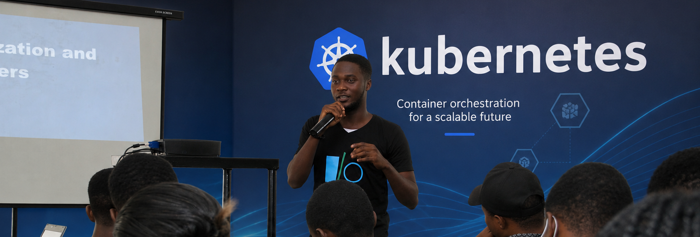

# Hi, I'm Dapo 👋

### Platform Engineer · Founding Engineer · Cloud & Kubernetes Specialist

I build platforms that help engineering teams deploy faster, operate reliably, and spend less on cloud infrastructure.

## Career Highlights 🚀

- 🏗️ **2× Founder / Founding Engineer** — built Hedgeflow and Hostloni from early ideas into operating technology products
- 💰 **Reduced AWS infrastructure costs by 45%** — cutting monthly spend from 90K to 49.5K and delivering 486K in annual savings
- ⚡ **Increased deployment frequency by 4×** — moving engineering teams from monthly releases to weekly deployments
- 🧰 **Built an internal developer platform** that reduced developer cognitive load and enabled self-service infrastructure
- ☸️ **Migrated production Kubernetes workloads from Kops to Amazon EKS**, improving scalability, governance, and operational efficiency
- 📈 **Supported infrastructure processing more than 30 million payment transactions per month**
- 🛡️ Experienced in fintech infrastructure, cloud security, AML/KYC, and compliance-aware engineering

## What I Work On 🛠️

- Internal developer platforms and self-service infrastructure
- Kubernetes, EKS, platform automation, and GitOps
- AWS architecture and cloud cost governance
- Terraform, CI/CD, Docker, Helm, and Crossplane
- Observability, SRE, incident response, and production reliability
- AI platforms, distributed systems, and event-driven architectures

## Current Focus 🧠

I am currently exploring how platform teams can use AI, policy-driven automation, and strong developer experience principles to help engineers build and deploy software with less operational complexity.

## Beyond Engineering ✨

I enjoy teaching and sharing practical knowledge about cloud infrastructure, Kubernetes, DevOps, and platform engineering with engineers across Africa and Europe.

## Connect With Me

- [LinkedIn](https://linkedin.com/in/dapseen)
- [Hedgeflow](https://hedgeflow.io)
- [GitHub](https://github.com/dapseen)
